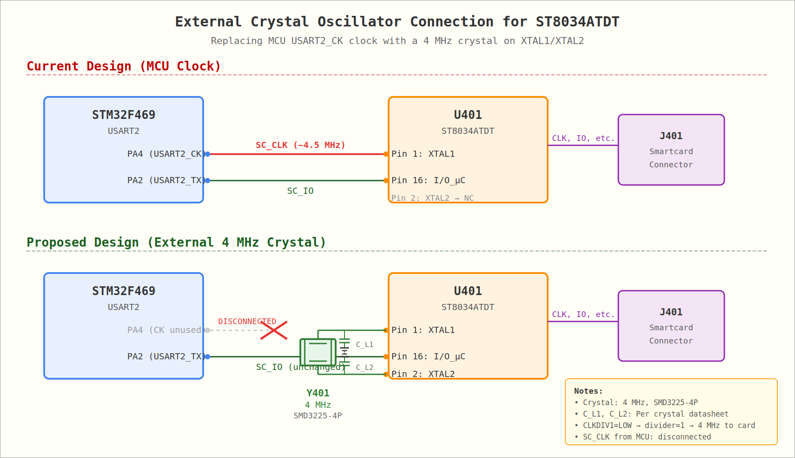

# Smartcard Interface: External Crystal Oscillator

## Current Design — MCU Clock Signal

The current Shield-BE design uses the **STM32F469 MCU's USART2_CK pin (PA4)** to provide the clock signal to the ST8034ATDT smartcard interface IC. The clock enters the ST8034 via its **XTAL1 pin (pin 1)**, with **XTAL2 (pin 2) left unconnected**.

### Current Clock Frequency

The clock frequency is determined by the STM32's USART smartcard-mode prescaler, defined in the firmware at [`f469-disco/usermods/scard/scard.h`](https://github.com/diybitcoinhardware/f469-disco/blob/master/usermods/scard/scard.h):

```c
#define SCARD_MAX_CLK_FREQUENCY_HZ  (5000000LU)  // 5 MHz max target
#define SCARD_ETU                   (372U)        // ISO 7816 elementary time unit
```

The actual output frequency calculation (from [`f469-disco/usermods/scard/ports/stm32/scard_io.c`](https://github.com/diybitcoinhardware/f469-disco/blob/master/usermods/scard/ports/stm32/scard_io.c)):

```c
uint32_t clk_in = get_usart_clock(usart_id);  // APB1 = 45 MHz for USART2
uint32_t prescaler = (clk_in + 2U * SCARD_MAX_CLK_FREQUENCY_HZ - 1U) /
                     (2U * SCARD_MAX_CLK_FREQUENCY_HZ);
// prescaler = ceil(45,000,000 / 10,000,000) = 5
uint32_t card_clk = clk_in / (2U * prescaler);
// card_clk = 45,000,000 / (2 × 5) = 4,500,000 Hz
```

| Parameter | Value |
|-----------|-------|
| MCU System Clock | 180 MHz |
| APB1 Peripheral Clock (PCLK1) | 45 MHz |
| USART2 Input Clock | 45 MHz |
| Prescaler (GTPR.PSC) | 5 |
| **SC_CLK Output Frequency** | **4.5 MHz** |
| USART Baudrate | 4,500,000 / 372 ≈ **12,097 baud** |

The smartcard reader Python configuration is in [`src/keystore/javacard/util.py`](../src/keystore/javacard/util.py):

```python
reader = sc.Reader(
    name="Specter card reader",
    ifaceId=2,            # USART2
    ioPin=Pin.cpu.A2,     # PA2 = USART2_TX (data)
    clkPin=Pin.cpu.A4,    # PA4 = USART2_CK (clock → ST8034 XTAL1)
    rstPin=Pin.cpu.G10,
    presPin=Pin.cpu.C2,
    pwrPin=Pin.cpu.C5,
)
```

### Signal Path (Current)
```
MCU PA4 (USART2_CK) ──[SC_CLK @ 4.5 MHz]──→ R403 (22Ω) ──→ ST8034 XTAL1 (pin 1)
                                                              ST8034 XTAL2 (pin 2) → NC
```

---

## Proposed Design — External Crystal Oscillator

The ST8034ATDT supports an external crystal connected between **XTAL1 (pin 1)** and **XTAL2 (pin 2)**, using its internal oscillator amplifier. This eliminates the need for the MCU to generate the clock signal.

### Recommended Crystal

A **4 MHz passive crystal** in an **SMD3225 (3.2×2.5mm) 4-pin package** is recommended:

| Parameter | Value |
|-----------|-------|
| Frequency | 4 MHz |
| Package | SMD3225-4P (3.2×2.5mm) |
| LCSC Part Number | **C70587** |
| MFR Part Number | X322520MPB4SI (YXC) |
| JLCPCB Status | **Basic/Preferred Part** |
| Load Capacitance | 20 pF (typical) |
| Frequency Tolerance | ±10 ppm |
| Operating Temp | -40°C to +85°C |

> **Note:** 4 MHz is a standard ISO 7816 smartcard clock frequency, well within the ST8034's supported range (up to 20 MHz). With CLKDIV1 = LOW (divider = 1, as in the current design), the full 4 MHz is passed to the card's CLK pin.

### Load Capacitors

The crystal requires two load capacitors (C_L1, C_L2) from each crystal pin to GND. The values depend on the crystal's specified load capacitance (C_L) and PCB stray capacitance (C_stray, typically ~2-5 pF):

```
C_L1 = C_L2 = 2 × (C_L - C_stray)
```

For C_L = 20 pF and C_stray ≈ 3 pF: **C_L1 = C_L2 ≈ 34 pF** (use standard 33 pF, 0402/0805).

### Connection Diagram



### Signal Path (Proposed)
```
MCU PA4 (USART2_CK) ──── DISCONNECTED (not routed to ST8034)

                  C_L1 (33pF)
                    │
ST8034 XTAL1 (pin 1) ──┤──── Y401 (4 MHz Crystal) ────┤── ST8034 XTAL2 (pin 2)
                    │                                   │
                   GND                                 GND
                                                        │
                                                    C_L2 (33pF)
```

### Hardware Changes Summary

1. **Remove** the SC_CLK trace from R403 to ST8034 XTAL1
2. **Add** 4 MHz crystal Y401 (C70587) between ST8034 XTAL1 (pin 1) and XTAL2 (pin 2)
3. **Add** load capacitors C_L1 and C_L2 (33 pF each) from XTAL1 and XTAL2 to GND
4. R403 (22Ω series resistor on SC_CLK) can be **removed** or left unpopulated

---

## Software Changes Required

**Yes, the firmware needs changes if the MCU clock is disconnected and an external crystal is used.**

### Why Changes Are Needed

The STM32's USART in smartcard mode currently ties its **data baudrate** to the **clock prescaler output**. Both are derived from the same source:

```c
// Current code in scard_io.c init_smartcard():
uint32_t card_clk = clk_in / (2U * prescaler);           // 4.5 MHz CK output
uint32_t baudrate = (card_clk + SCARD_ETU / 2U) / SCARD_ETU;  // ≈ 12,097 baud
```

When the MCU generates the clock, the data timing and card clock are inherently synchronized because they come from the same USART peripheral. With an external 4 MHz crystal, the card operates at 4 MHz, but the MCU's USART would still internally calculate baudrate from its own prescaler (4.5 MHz), causing a **~12.5% frequency mismatch** that would corrupt smartcard communication.

### Required Firmware Changes

#### 1. Baudrate Calculation (`f469-disco/usermods/scard/ports/stm32/scard_io.c`)

The baudrate must be calculated from the **external crystal frequency** instead of the USART prescaler:

```c
// New: define external crystal frequency
#define SCARD_EXTERNAL_CLK_HZ  (4000000LU)  // 4 MHz crystal

static bool init_smartcard(SMARTCARD_HandleTypeDef* sc_handle,
                           USART_TypeDef* usart_handle, uint8_t usart_id) {
    uint32_t clk_in = get_usart_clock(usart_id);

    // Prescaler still needed (USART requires valid value), but CK pin is unused
    uint32_t prescaler = 1U;  // Minimum valid value

    // Baudrate must match the EXTERNAL crystal frequency, not the USART CK
    uint32_t baudrate = (SCARD_EXTERNAL_CLK_HZ + SCARD_ETU / 2U) / SCARD_ETU;
    // = 4,000,000 / 372 ≈ 10,753 baud

    sc_handle->Init.Prescaler = prescaler;
    sc_handle->Init.BaudRate  = baudrate;
    // ... rest unchanged
}
```

| Parameter | Current (MCU Clock) | Proposed (4 MHz Crystal) |
|-----------|-------------------|------------------------|
| Card CLK frequency | 4.5 MHz | 4.0 MHz |
| USART baudrate | ~12,097 baud | ~10,753 baud |
| USART prescaler | 5 | 1 (or any valid value) |
| CK pin function | Drives ST8034 XTAL1 | Unused (still toggles) |

#### 2. CLK Pin Configuration (Optional)

The `clk_pin` parameter and its USART alternate-function configuration can optionally be **kept as-is**. The USART_CK pin will still toggle at its own frequency, but since it's physically disconnected from the ST8034, this is harmless. Removing the pin configuration is a cosmetic improvement but not strictly necessary.

If you want to make the CLK pin fully optional:

```c
// In init_pins():
static bool init_pins(mp_obj_t io_pin, mp_obj_t clk_pin, uint8_t usart_id) {
    bool ok = mp_hal_pin_config_alt(
        pin_find(io_pin), MP_HAL_PIN_MODE_ALT_OPEN_DRAIN, MP_HAL_PIN_PULL_UP,
        AF_FN_USART, usart_id);

    // Only configure CK pin if provided (allow None for external crystal designs)
    if(clk_pin != mp_const_none) {
        ok = ok && mp_hal_pin_config_alt(
            pin_find(clk_pin), MP_HAL_PIN_MODE_ALT, MP_HAL_PIN_PULL_UP,
            AF_FN_USART, usart_id);
    }
    return ok;
}
```

#### 3. Python Configuration (`src/keystore/javacard/util.py`)

If the CLK pin is made optional in the C layer:

```python
reader = sc.Reader(
    name="Specter card reader",
    ifaceId=2,
    ioPin=Pin.cpu.A2,
    clkPin=None,           # No MCU clock output needed (external crystal)
    rstPin=Pin.cpu.G10,
    presPin=Pin.cpu.C2,
    pwrPin=Pin.cpu.C5,
)
```

### Minimum Viable Change

The **absolute minimum** firmware change to support an external crystal is a **single-line edit** to the baudrate calculation — changing the frequency used from the derived USART CK frequency to the known external crystal frequency. The USART prescaler and CK pin can remain configured (they just become functionally unused).

---

## Using ST8034TDT Instead of ST8034ATDT (Zero Software Changes)

The **ST8034TDT** has better availability than the ST8034ATDT but has a different clock divider behavior. The key difference is:

| Device | CLKDIV = LOW | CLKDIV = HIGH |
|--------|-------------|---------------|
| **ST8034ATDT** | fXTAL (÷1) | fXTAL / 2 |
| **ST8034TDT** | fXTAL / 4 | fXTAL / 2 |

The current Shield-BE design uses the ST8034ATDT with **CLKDIV1 = LOW** (÷1 mode), so the card receives the full XTAL1 input frequency (4.5 MHz from the MCU). The ST8034TDT's **minimum divider is ÷2** (CLKDIV = HIGH), not ÷1.

### The Problem

If you simply swap ST8034ATDT → ST8034TDT without changes:
- MCU outputs 4.5 MHz on USART2_CK → enters ST8034 XTAL1
- ST8034TDT with CLKDIV=HIGH divides by 2 → card receives **2.25 MHz**
- But the firmware baudrate is based on 4.5 MHz → **12,097 baud**
- Card expects baudrate at 2.25 MHz / 372 = **6,048 baud**
- **2× mismatch → communication failure**

### The Solution: 9 MHz External Crystal

Use a **9 MHz external crystal** on the ST8034TDT's XTAL1/XTAL2 pins, with **CLKDIV = HIGH** (÷2 divider):

```
9 MHz crystal ÷ 2 = 4.5 MHz to card
```

This produces **exactly 4.5 MHz** at the card — the same frequency the current MCU clock provides. The firmware's baudrate calculation yields:

```c
// Firmware (unchanged):
clk_in = 45,000,000 Hz (APB1)
prescaler = 5
card_clk = 45,000,000 / (2 × 5) = 4,500,000 Hz
baudrate = 4,500,000 / 372 ≈ 12,097 baud

// Card (with 9 MHz crystal, ÷2):
card_clk = 9,000,000 / 2 = 4,500,000 Hz
expected_baudrate = 4,500,000 / 372 ≈ 12,097 baud  ✓ EXACT MATCH
```

**No software changes are needed.** The MCU's USART2_CK pin (PA4) still toggles at 4.5 MHz but is physically disconnected from the ST8034. The USART data baudrate (12,097) exactly matches what the card expects from its 4.5 MHz clock. Both sides agree on the timing.

### Hardware Changes for ST8034TDT

1. **Replace** U401: ST8034ATDT → **ST8034TDT** (pin-compatible, same SO-16 package)
2. **Disconnect** SC_CLK trace from MCU PA4 to ST8034 XTAL1
3. **Add** Y401: **9 MHz crystal** (SMD3225-4P) between XTAL1 (pin 1) and XTAL2 (pin 2)
4. **Add** load capacitors C_L1, C_L2 from XTAL1/XTAL2 to GND
5. **Change CLKDIV1 = HIGH** (currently LOW) — tie to VCC or MCU GPIO HIGH
6. **Remove** R403 (22Ω SC_CLK series resistor, no longer needed)

### CLKDIV Pin Configuration Change

The current schematic has `SC_CLKDIV1 = LOW` for the ST8034ATDT's ÷1 mode. For the ST8034TDT, this must change to **HIGH** for the ÷2 divider:

| Pin | Current (ST8034ATDT) | New (ST8034TDT) | Effect |
|-----|---------------------|-----------------|--------|
| CLKDIV (pin 6) | LOW (÷1) | **HIGH (÷2)** | 9 MHz / 2 = 4.5 MHz |

On the MCU interface sheet, SC_CLKDIV1 is routed to an MCU GPIO. Either:
- Tie it HIGH (to VCC through a resistor), or
- Set the MCU GPIO to output HIGH in firmware (trivial, but technically a "change")

The simplest zero-firmware-change approach is to **tie CLKDIV1 to VCC** via a pull-up resistor on the shield PCB.

### Signal Path (ST8034TDT with 9 MHz Crystal)
```
MCU PA4 (USART2_CK) ──── DISCONNECTED (not routed to ST8034)

                  C_L1
                    │
ST8034TDT XTAL1 ───┤──── Y401 (9 MHz Crystal) ────┤── ST8034TDT XTAL2
                    │                                │
                   GND                              GND
                                                     │
                                                   C_L2

CLKDIV (pin 6) ──── HIGH (VCC via pull-up)

Card CLK = 9 MHz / 2 = 4.5 MHz  ← identical to current design
USART baudrate = 12,097 baud     ← unchanged firmware
```

### 9 MHz Crystal Selection

9 MHz is **not commonly available as a JLCPCB basic part** in SMD3225. Options:

| Option | Frequency | JLCPCB Status | LCSC | Notes |
|--------|-----------|---------------|------|-------|
| **Option A** | 9 MHz SMD3225 | Extended part | — | Check LCSC for availability; extended parts have ~$3 setup fee |
| **Option B** | 8 MHz SMD3225 | **Basic part** | C115962 | Card CLK = 4 MHz; requires firmware baudrate change |

**If 9 MHz must be sourced as an extended part**, the additional cost is minimal ($3 one-time per order). This is the recommended approach for **zero software changes**.

**If a JLCPCB basic part is strictly required**, an 8 MHz crystal could be used:
- 8 MHz / 2 = 4.0 MHz to card → baudrate = 4,000,000 / 372 ≈ 10,753 baud
- Firmware expects 12,097 baud → **~12.5% mismatch, requires firmware change**
- This defeats the zero-software-change goal

### Summary Comparison

| Configuration | IC | Crystal | Divider | Card CLK | Firmware Change? |
|---------------|-----|---------|---------|----------|-----------------|
| Current design | ST8034ATDT | None (MCU CK) | ÷1 | 4.5 MHz | None (baseline) |
| ATDT + crystal (prev section) | ST8034ATDT | 4 MHz | ÷1 | 4.0 MHz | **Yes** (baudrate) |
| **TDT + 9 MHz crystal** | **ST8034TDT** | **9 MHz** | **÷2** | **4.5 MHz** | **None** ✓ |
| TDT + 8 MHz crystal | ST8034TDT | 8 MHz | ÷2 | 4.0 MHz | **Yes** (baudrate) |

**Recommendation: Use the ST8034TDT with a 9 MHz crystal and CLKDIV=HIGH.** This achieves the exact same 4.5 MHz card clock as the current design, requiring zero firmware changes and allowing the ST8034TDT to be used as a drop-in replacement (with only the crystal and CLKDIV pull-up as PCB changes).

---

## BOM Impact

### For ST8034ATDT with 4 MHz Crystal (original proposal)

| Ref | Part | Action | LCSC | Notes |
|-----|------|--------|------|-------|
| Y401 | 4 MHz Crystal SMD3225 | **ADD** | C70587 | JLCPCB Basic Part |
| C_L1 | 33 pF 0805 | **ADD** | — | Load cap for crystal |
| C_L2 | 33 pF 0805 | **ADD** | — | Load cap for crystal |
| R403 | 22Ω 0805 | **REMOVE** | — | SC_CLK series resistor (no longer needed) |

### For ST8034TDT with 9 MHz Crystal (zero firmware changes)

| Ref | Part | Action | LCSC | Notes |
|-----|------|--------|------|-------|
| U401 | ST8034TDT | **REPLACE** | — | Better availability than ATDT |
| Y401 | 9 MHz Crystal SMD3225 | **ADD** | — | JLCPCB Extended Part (check LCSC) |
| C_L1 | Load cap (per crystal spec) | **ADD** | — | Load cap for crystal |
| C_L2 | Load cap (per crystal spec) | **ADD** | — | Load cap for crystal |
| R_PU | 10kΩ 0402 pull-up | **ADD** | C25804 | CLKDIV1 pull-up to VCC |
| R403 | 22Ω 0805 | **REMOVE** | — | SC_CLK series resistor (no longer needed) |

Net component change: +3 components (crystal + 2 caps + pull-up - 1 resistor).
