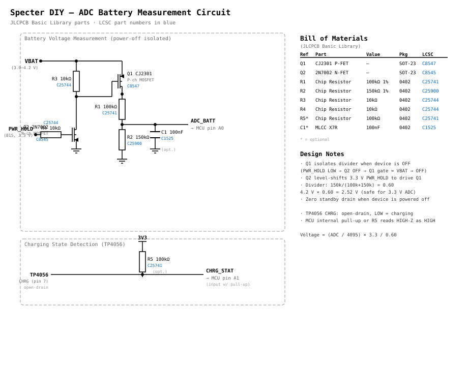

# Battery ADC Measurement – Shield Board Schematic

This document describes the circuit used on the new Specter shield board to
measure battery voltage and charging state through two MCU GPIO pins,
**without discharging the battery when the device is powered off**.

---

## Pin assignment

| Signal              | MCU pin (default) | Arduino header | Direction |
|---------------------|--------------------|----------------|-----------|
| Battery voltage ADC | **A0** (PA6)       | CN5-A0         | Analog in |
| Charging state      | **A1** (PA4¹)      | CN5-A1         | Digital in |

> ¹ On the new shield these pins are no longer routed to the smartcard
> connector – they replace the unused SC AUX2 and the adjacent pad.

Set the pins in your `config.py`:

```python
BATTERY_ADC_PIN = "A0"
BATTERY_CHARGING_PIN = "A1"
```

---

## 1. Battery voltage measurement (with power-off isolation)

The key requirement is that the measurement circuit draws **zero current**
when the device is off.  This is achieved with a P-channel MOSFET that is
controlled by the existing power-hold signal (`PWR_HOLD`, active-high on
pin B15).

### Schematic

```
                  PWR_HOLD (B15, active-high)
                      │
                      │ 10 kΩ
                      ├───[R3]───┐
                      │          │
                     ┌┘          │
  VBAT ──────────────┤S       G ├──── GND (when PWR_HOLD=LOW, gate is
         (3.0–4.2 V) │  Q1      │     pulled to VBAT via R3 → OFF)
                     └┤D
                      │
                      ├───[R1 100 kΩ]───┬───[R2 150 kΩ]───── GND
                      │                 │
                      │             ADC_BATT (to MCU A0)
                      │
                      └── (optional 100 nF filter cap C1 to GND)
```

### Component values

| Ref | Part                       | Value    | Notes                                     |
|-----|----------------------------|----------|--------------------------------------------|
| Q1  | P-ch MOSFET (CJ2301)       | –        | V_GS(th) < −1 V, R_DS(on) < 1 Ω          |
| R1  | Resistor                   | 100 kΩ   | Upper leg of voltage divider               |
| R2  | Resistor                   | 150 kΩ   | Lower leg of voltage divider               |
| R3  | Gate pull-up resistor      | 10 kΩ    | Ensures Q1 is OFF when PWR_HOLD is LOW     |
| C1  | Ceramic capacitor (opt.)   | 100 nF   | Low-pass filter on ADC input               |

### How it works

| State        | PWR_HOLD | Q1 gate          | Q1    | Divider current |
|--------------|----------|-------------------|-------|-----------------|
| Device **ON**  | HIGH (3.3 V) | ≈ 0 V (gate pulled low through R3 path)¹ | **ON**  | ≈ 17 µA  |
| Device **OFF** | LOW / Hi-Z  | Pulled to V_BAT by R3 | **OFF** | **0 µA** |

> ¹ When PWR_HOLD is HIGH the N-channel level-shift (see below) pulls
> Q1's gate to GND, turning Q1 ON.  When PWR_HOLD is LOW the P-FET's
> gate is pulled to its source (V_BAT) through R3, guaranteeing it is
> OFF.

#### Gate drive detail (level shift)

Because PWR_HOLD is a 3.3 V logic signal and V_BAT can be up to 4.2 V,
a small N-channel MOSFET (2N7002) is used to pull Q1's gate low:

```
  PWR_HOLD ──[R4 10 kΩ]──┬── Gate of Q2 (N-ch, 2N7002)
                          │
                         GND (Q2 source)
                          │
                  Q2 drain ──── Q1 gate
                                  │
                          R3 to VBAT (pull-up)
```

When `PWR_HOLD = HIGH → Q2 ON → Q1 gate ≈ 0 V → Q1 ON` (divider active).
When `PWR_HOLD = LOW  → Q2 OFF → Q1 gate ≈ VBAT → Q1 OFF` (no current).

### Voltage divider calculation

```
  divider ratio = R2 / (R1 + R2) = 150 k / 250 k = 0.60

  At full charge:   4.20 V × 0.60 = 2.52 V  (well within 3.3 V ADC ref)
  At empty:         3.60 V × 0.60 = 2.16 V
  At dead:          3.00 V × 0.60 = 1.80 V
```

The firmware reconstructs the actual battery voltage:

```python
voltage = (adc_reading / 4095) * 3.3 / 0.60
```

The `BATTERY_ADC_DIVIDER_RATIO` setting in `config.py` (default **0.6**)
must match the physical resistor values.

---

## 2. Charging state detection (TP4056)

The **TP4056** linear Li-Ion charger IC has two open-drain status outputs:

| Pin  | Name   | LOW (sinking)       | HIGH-Z (open)                    |
|------|--------|---------------------|----------------------------------|
| 7    | CHRG   | Charging in progress | Not charging                    |
| 6    | STDBY  | Charge complete      | Not in standby                  |

Combined truth table:

| CHRG | STDBY | Meaning                        |
|------|-------|--------------------------------|
| LOW  | HIGH  | Charging in progress           |
| HIGH | LOW   | Charge complete (standby)      |
| HIGH | HIGH  | No battery / no USB / shutdown |

> Both outputs are **open-drain** — they can only pull LOW or float.  An
> external (or MCU-internal) pull-up resistor is required to read a
> logic HIGH when the pin is not being driven.

We connect the **CHRG** (pin 7) output to the MCU.  This gives the
firmware a simple binary signal: LOW = charging, HIGH = not charging.

### Schematic

```
  TP4056 pin 7 (CHRG) ────┬──── MCU A1 (digital input, internal pull-up)
                           │
                          [R5 100 kΩ] (external pull-up to 3.3 V, optional
                           │            if MCU internal pull-up is used)
                          3V3
```

The firmware configures the pin with an internal pull-up and reads:

* `pin.value() == 0` → **charging**
* `pin.value() == 1` → **not charging / complete**

No isolation MOSFET is needed here because the TP4056 is powered from
USB VBUS; when VBUS is absent the CHRG output is floating (HIGH-Z) and
the MCU is off, so no current flows through the pull-up.

> **Tip:** If you also want to distinguish *charge complete* from
> *no battery / USB disconnected*, connect STDBY (pin 6) to a second
> GPIO with a pull-up in the same way and check both pins in firmware.

---

## 3. Full circuit overview

```
                            ┌─────────────────────────┐
  USB 5 V ──►  Charger IC  │  TP4056                  │
              (on shield)   │                         │
                            │  VBAT ◄──► Li-Ion cell  │
                            │  CHRG (pin 7) ──────────┼──► MCU A1
                            └────────────┬────────────┘
                                         │ VBAT
                    ┌────────────────────┘
                    │
                    ├── Q1 (P-FET, gate driven by PWR_HOLD via Q2)
                    │    │
                    │   [R1 100k]
                    │    │
                    │    ├──► MCU A0 (ADC)
                    │    │
                    │   [R2 150k]
                    │    │
                    │   GND
                    │
                    └──► rest of power supply (DC-DC converter → 3.3 V)
```

---

## 4. Schematic diagram



## 5. Bill of Materials (measurement circuit only)

All parts below are from the **JLCPCB Basic Library** (no extended-part
surcharge).

| Ref | Part                    | Value      | Package | LCSC    |
|-----|-------------------------|------------|---------|---------|
| Q1  | CJ2301 P-ch MOSFET     | –          | SOT-23  | C8547   |
| Q2  | 2N7002 N-ch MOSFET     | –          | SOT-23  | C8545   |
| R1  | Chip Resistor 1 %      | 100 kΩ    | 0402    | C25741  |
| R2  | Chip Resistor 1 %      | 150 kΩ    | 0402    | C25900  |
| R3  | Chip Resistor          | 10 kΩ     | 0402    | C25744  |
| R4  | Chip Resistor          | 10 kΩ     | 0402    | C25744  |
| R5  | Chip Resistor (opt.)   | 100 kΩ    | 0402    | C25741  |
| C1  | MLCC X7R (opt.)        | 100 nF    | 0402    | C1525   |

Total added cost: **< $0.15**

---

## 6. Software configuration

**Auto-detection is the default.**  The firmware probes pin A0 for a
plausible Li-Ion voltage (2.5 V – 4.5 V after divider correction) on
the first battery status request.  If the reading is in range the ADC
path is used; otherwise the firmware falls back to the I2C fuel-gauge.
The detected method is cached for the lifetime of the session.

No `config.py` or `boot.py` changes are required for the standard
wiring (A0 = ADC, A1 = CHRG).  If you use different pins or a
different divider ratio, override the defaults:

```python
# config.py – only needed for non-standard wiring
BATTERY_ADC_PIN = "A0"              # ADC pin connected to the voltage divider
BATTERY_ADC_DIVIDER_RATIO = 0.6     # R2/(R1+R2) — must match hardware
BATTERY_CHARGING_PIN = "A1"         # TP4056 CHRG pin (active-low)
```

To disable ADC probing entirely (e.g. if pin A0 is used for something
else), set `BATTERY_ADC_PIN = None` in your `config.py`.
