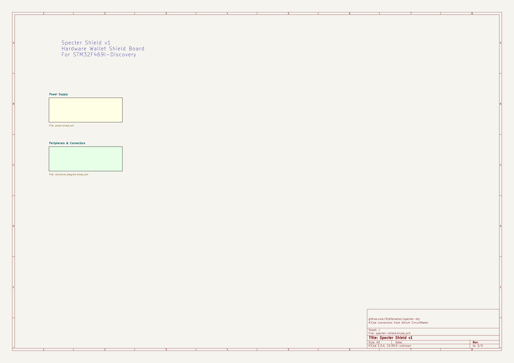
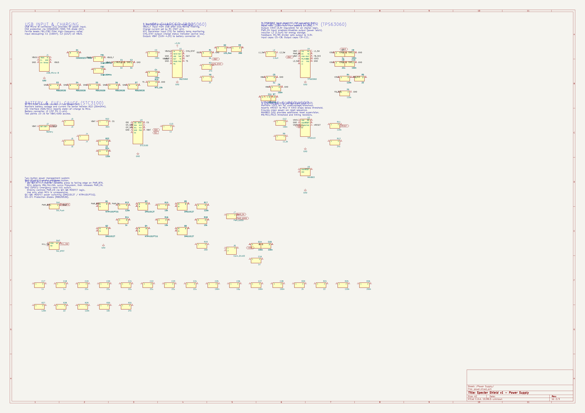
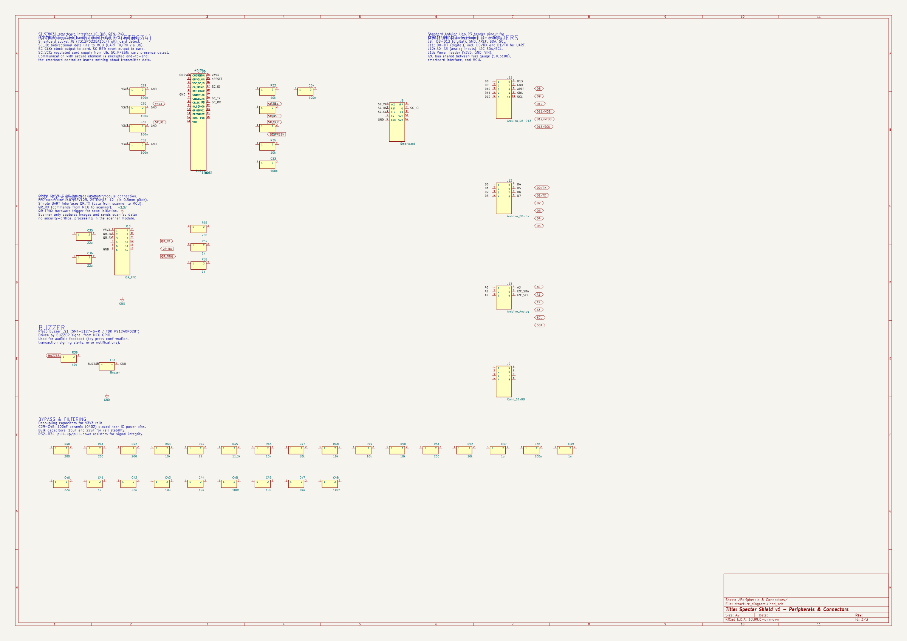
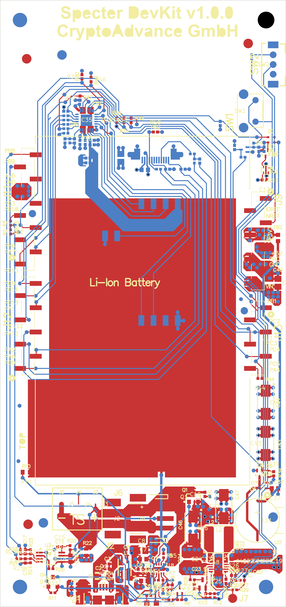

# Specter Shield v1 - KiCad Project

This KiCad project was converted from the original Altium CircuitMaker design files (Gerber production files, drill files, and pick-and-place data). Schematic wiring and footprint assignments have been completed.

## Rendered Images

### Main Sheet (Hierarchy)


### Power Supply Sheet


### Peripherals & Connectors Sheet


### PCB Layout


## Project Structure

```
kicad/
├── specter-shield.kicad_pro          # KiCad project file
├── specter-shield.kicad_pcb          # PCB layout (converted from Gerbers)
├── specter-shield.kicad_sch          # Main schematic (top-level hierarchy)
├── power.kicad_sch                   # Sub-sheet: Power supply (USB, charger, buck-boost, supervisor)
├── structure_diagram.kicad_sch       # Sub-sheet: Peripherals & connectors (smartcard, QR, headers)
├── specter_shield.kicad_sym          # Component symbol library (139 symbols with pin definitions)
├── specter-shield.pretty/            # Custom footprint library
├── renders/                          # Rendered schematic and PCB images
│   ├── main_sheet.png
│   ├── power_supply.png
│   ├── peripherals_connectors.png
│   └── pcb_layout.png
├── fp-lib-table                      # Footprint library paths
├── sym-lib-table                     # Symbol library paths
└── README.md                         # This file
```

## Board Specifications

- **Dimensions:** ~60mm × 127mm (with corner notch)
- **Layers:** 4-layer stackup
  - F.Cu (Top copper - signal)
  - In1.Cu (Power plane)
  - In2.Cu (Ground plane)
  - B.Cu (Bottom copper - signal)
- **Thickness:** 1.6mm FR4
- **Components:** 139 (both sides)
- **Drill holes:** 296 plated + 4 NPTH mounting

## What Was Converted

### PCB (`specter-shield.kicad_pcb`)
- ✅ Board outline (Edge.Cuts) from Gerber outline file
- ✅ Copper traces and pads imported as graphics on F.Cu, B.Cu, In1.Cu, In2.Cu
- ✅ Silkscreen graphics on F.SilkS and B.SilkS
- ✅ Solder mask openings on F.Mask and B.Mask
- ✅ Paste layer data on F.Paste and B.Paste
- ✅ Drill holes imported as vias (plated) and NPTH pads (non-plated)
- ✅ Component placements with reference designators and values from pick-and-place data
- ⚠️ Copper data is imported as **graphic primitives** (lines, rectangles, circles), not as proper tracks/pads with net assignments

### Schematics
- ✅ All 139 components with designators, values, pin definitions, and footprint assignments
- ✅ Organized into 2 sub-sheets:
  - **Power Supply** - USB input, BQ25060 charger, TPS63060 buck-boost, TPS3422 supervisor, STC3100 fuel gauge, MAX803, MOSFETs, switches
  - **Peripherals & Connectors** - ST8034 smartcard IC, smartcard socket (J8), QR scanner FFC (J10), Arduino headers (J9/J11-J13), buzzer
- ✅ **Schematic wiring** - Key signal nets connected with wire segments and labels (VBUS, VBAT, V3V3, GND, I2C, SPI, UART, etc.)
- ✅ **KiCad standard footprints** assigned to all components from the KiCad 8.x library
- ✅ **Global labels** for inter-sheet signal connectivity (VBAT, V3V3, nRESET, PWR_EN, SDA, SCL, etc.)

### Footprint Assignments

All 139 components have footprints assigned from KiCad standard libraries:

| Component Type | Footprint Library | Package |
|---------------|------------------|---------|
| Resistors (R1-R52) | Resistor_SMD | R_0402_1005Metric (R_0805 for R22 sense) |
| Capacitors (C1-C48) | Capacitor_SMD | C_0402_1005Metric (C_0805 for ≥10µF) |
| TPS63060 (U4) | Package_SON | VSON-10-1EP_3x3mm |
| BQ25060 (U1) | Package_DFN_QFN | DFN-10-1EP_2.5x2.5mm |
| STC3100 (U3) | Package_DFN_QFN | DFN-8-1EP_3x3mm |
| TPS3422 (U2) | Package_DFN_QFN | DFN-6-1EP_2x2mm |
| MAX803 (U5) | Package_TO_SOT_SMD | SOT-23 |
| ST8034 (U6) | Package_DFN_QFN | QFN-24-1EP_4x4mm |
| MOSFETs (Q1-Q6) | Package_TO_SOT_SMD | SOT-23 / SOT-523 |
| USB Micro-B (J1) | Connector_USB | USB_Micro-B_Molex |
| Battery (J2) | Connector_JST | JST_PH_S2B |
| Smartcard (J8) | Connector_Card | Smartcard_C-707 |
| QR FFC (J10) | Connector_FFC-FPC | Hirose_FH12 |
| Arduino headers | Connector_PinHeader_2.54mm | PinHeader 6/8/10-pin |
| Diodes (D1-D7) | Diode_SMD | D_SOD-323 / D_SOD-523 |
| Ferrite beads | Inductor_SMD | L_0603_1608Metric |
| Inductors | Inductor_SMD | L_0805 / L_Taiyo-Yuden |
| Buzzer (LS1) | Buzzer_Beeper | Buzzer_TDK_PS1240P02BT |

## Validation Results

### ERC (Electrical Rules Check)
- Power sheet: 241 errors (mostly unconnected pins on passives), 551 warnings (grid alignment)
- Peripherals sheet: 138 errors (unconnected pins), 19 warnings
- Most errors are expected: passive component pins not yet fully wired to named nets

### DRC (Design Rules Check)
- PCB: 266 errors, 887 warnings
- Top types: hole_clearance (200), lib_footprint_issues (199), silk_overlap (199)
- Expected for Gerber-imported PCB with copper as graphics

## What Needs Manual Completion

### Medium Priority
1. **Complete schematic wiring** - Wire remaining unconnected passive pins to their respective nets
2. **Net assignment** - Import netlist from schematics to PCB to assign nets to copper features
3. **Symbol refinement** - Replace generic rectangle symbols with proper KiCad schematic symbols
4. **Copper trace refinement** - Convert imported graphic copper data to proper KiCad tracks and filled zones

### Low Priority
5. **3D models** - Assign 3D models to component footprints
6. ~~**BOM fields** - Add manufacturer part numbers and supplier info~~ ✅ LCSC part numbers assigned

## Key Components & LCSC Part Numbers

All components have been assigned LCSC part numbers for JLCPCB assembly where available. Pinouts have been verified against manufacturer datasheets.

### ICs (Pinouts Verified ✓)

| Designator | Part | Description | LCSC | Pinout Status |
|-----------|------|-------------|------|---------------|
| U1 | BQ25060DQCR | Li-ion battery charger (DFN-10) | C2835501 | ✓ Verified: IN/ISET2/VSS/OUT/PGND/PG/CE/ISET/TMR/TS/PAD |
| U2 | TPS3422EGDRYR | Voltage supervisor (DFN-6) | N/A¹ | ✓ Verified: VDD/GND/SENSE/CT/~MR/~RESET/PAD |
| U3 | STC3100IST | Battery fuel gauge (DFN-8) | C2969798 | ✓ Verified: IO0/SDA/SCL/GND/CG/ROSC/ALM/VCC/PAD |
| U4 | TPS63060DSCR | Buck-boost converter (VSON-10) | C48567 | ✓ Verified: VIN/EN/VINA/PS-SYNC/L2/L1/PG/FB/VOUT/GND/PAD |
| U5 | MAX803SQ293D2T1G | Voltage detector (SOT-23²) | N/A¹ | ✓ Verified: GND/VCC/~RESET |
| U6 | ST8034HNQR | Smartcard interface (QFN-24) | C2674058 | ✓ Verified: 24 pins + PAD match datasheet |

¹ Not available on LCSC — requires manual sourcing from DigiKey/Mouser
² Note: MAX803SQ variant is SC-70-3 package; footprint may need adjustment for exact fit

### MOSFETs & Transistors (Pinouts Verified ✓)

| Designator | Part | LCSC | Pins |
|-----------|------|------|------|
| Q1, Q4 | NTR4101PT1G (P-ch SOT-23) | C35920 | G=1, S=2, D=3 ✓ |
| Q2, Q3, Q5, Q6 | DMG1012T (N-ch SOT-523) | C42385153 | G=1, S=2, D=3 ✓ |

### Diodes

| Designator | Part | LCSC |
|-----------|------|------|
| D1 | CDSOD323-T05S (TVS, SOD-323) | C3706224 |
| D2 | LED_Red (0603) | C2286 |
| D3–D7 | RB520S30 (Schottky, SOD-523) | C167132 |

### Connectors

| Designator | Part | LCSC |
|-----------|------|------|
| J1 | USB Micro-B (Molex 47346-0001) | C132560 |
| J2 | JST PH 2-pin battery (S2B-PH-SM4-TB) | C295747 |
| J6 | JST PH 3-pin (S3B-PH-SM4-TB) | C265101 |
| J8 | Smartcard socket (C-707-10M008-S) | N/A¹ |
| J10 | FFC 12-pin (Hirose FH12-12S-0.5SH) | C88360 |
| J3–J5 | Test point pads | N/A (bare pads) |
| J7, J9, J11–J13 | Pin headers (2.54mm) | Generic |

### Switches & Buzzer

| Designator | Part | LCSC |
|-----------|------|------|
| SW1 | C&K RS282G05A3 (push button) | C221930 |
| SW2 | C&K OS102011MA1QN1 (SPDT slide) | C226259 |
| LS1 | TDK PS1240P02BT (buzzer) | C76871 |

### Passives — Resistors (0402 unless noted)

| Value | Designators | LCSC |
|-------|------------|------|
| 22Ω | R5, R21, R23, R28, R44 | C25092 |
| 30mΩ (0805) | R22 | C23209 |
| 200Ω | R3, R19, R36, R40–R42, R51 | C26083 |
| 1kΩ | R1, R14, R37, R38 | C11702 |
| 2kΩ | R8, R20 | C25794 |
| 10kΩ | R15, R16, R18, R30, R32–R35, R39, R43, R46–R50, R52 | C25804 |
| 11.3kΩ | R9, R45 | C15000 |
| 24kΩ | R2, R7, R12, R31 | C15749 |
| 120kΩ | R4, R6, R11, R13, R17, R24, R25, R27, R29 | C138051 |
| 200kΩ | R26 | C156444 |
| NTC 10kΩ | R10 | C525371 |

### Passives — Capacitors (0402 unless noted)

| Value | Designators | LCSC |
|-------|------------|------|
| 10pF | C26 | C1557 |
| 1nF | C1, C2, C13, C16, C17, C39 | C1560 |
| 100nF | C3, C4, C6, C9–C12, C14, C15, C25, C27–C34, C38, C45, C48 | C1525 |
| 1µF | C5, C7, C18, C37, C41 | C307331 |
| 10µF (0805) | C43, C44, C46, C47 | C15850 |
| 22µF (0805) | C8, C19–C24, C35, C36, C40, C42 | C784585 |

### Ferrite Beads & Inductors

| Designator | Part | LCSC |
|-----------|------|------|
| FB1, FB2 | Ferrite bead 0603 (~1kΩ@100MHz) | C1002 |
| L2 | 1.5µH inductor (Taiyo Yuden NR5040) | C49990 |

## Original Design Source

The original design was created in Altium CircuitMaker:
https://circuitmaker.com/Projects/Details/MikhailTolkachev/specter-shield

The production files used for this conversion are in the `../specter-shield/` directory.

## KiCad Version

This project targets **KiCad 8.x** file format (version 20240108).
