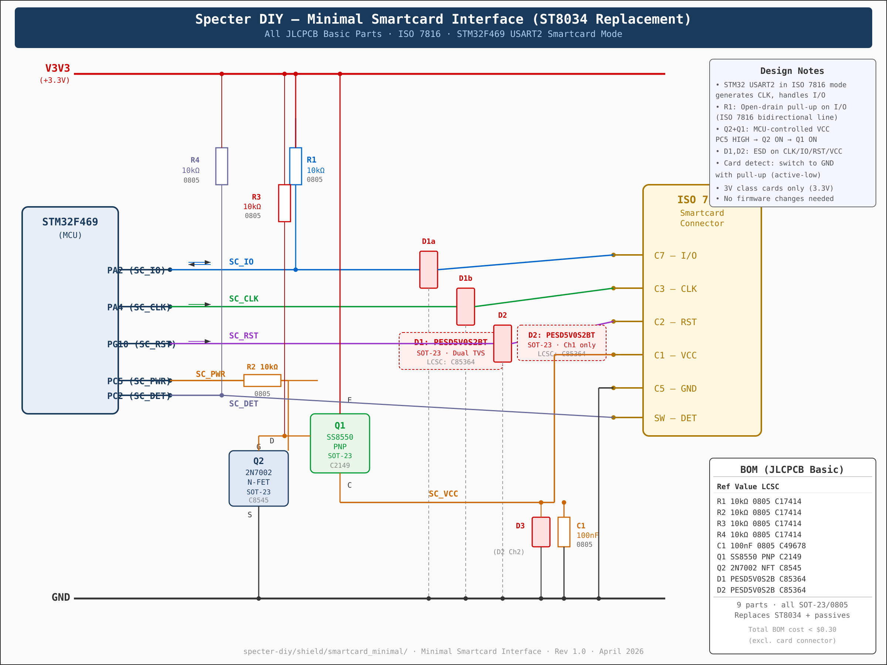

# Minimal Smartcard Interface (ST8034 Replacement)



## Overview

This circuit replaces the ST8034 smartcard interface IC with a minimal discrete
design using only JLCPCB basic parts. It pipes the CLK and data (I/O) lines
straight through from the STM32F469 MCU to the smartcard, adds ESD/TVS
protection on every signal line, and powers the card from the 3.3V rail through
a MCU-controlled switch.

**No firmware changes are required** — the MCU pin assignments and `uscard`
driver configuration remain identical to the original ST8034-based shield.

## MCU Pin Mapping

These pins are defined in `src/keystore/javacard/util.py` and are unchanged:

| MCU Pin | Net Name | Function | ISO 7816 Pin |
|---------|----------|----------|-------------|
| PA2     | SC_IO    | Bidirectional data (USART2 in ISO 7816 mode) | C7 (I/O) |
| PA4     | SC_CLK   | Clock output (USART2 smartcard clock) | C3 (CLK) |
| PG10    | SC_RST   | Reset output (active-low) | C2 (RST) |
| PC5     | SC_PWR   | Power enable (active-high) | — |
| PC2     | SC_DET   | Card detect (active-low) | — |

## Circuit Description

### Signal Lines (Direct Pass-Through)

- **SC_IO (PA2 → Card C7):** The ISO 7816 I/O line is bidirectional and
  open-drain. A 10kΩ pull-up resistor (R1) to V3V3 is required per the ISO 7816
  spec. This is the same pull-up the ST8034 provides internally.

- **SC_CLK (PA4 → Card C3):** The smartcard clock is generated by the STM32's
  USART2 peripheral in ISO 7816 mode. It passes straight through — no
  buffering needed at these frequencies (typically 1–5 MHz).

- **SC_RST (PG10 → Card C2):** The reset line passes straight through from the
  MCU. The STM32 drives this directly.

### ESD Protection

All signal lines are protected by TVS diodes to prevent ESD damage:

- **D1 (PESD5V0S2BT):** Dual-channel TVS in SOT-23. Channel 1 protects SC_IO,
  channel 2 protects SC_CLK.
- **D2 (PESD5V0S2BT):** Second dual TVS. Channel 1 protects SC_RST, channel 2
  protects SC_VCC.

The PESD5V0S2BT has 5V standoff voltage and very low capacitance (~35pF),
suitable for the smartcard signalling speeds without affecting timing.

### Power Switch (VCC Control)

The ST8034's main active function was controlling card VCC. We replace it with a
simple two-transistor high-side switch:

```
PC5 (HIGH to enable) → R2 (10kΩ) → Q2 gate (2N7002 N-FET)
                                       │
Q2 drain ──────────────────────────── Q1 base (SS8550 PNP)
                                       │
Q1 emitter ← V3V3                     Q1 collector → SC_VCC → Card C1
                                       │
R3 (10kΩ) pulls Q1 base to V3V3      C1 (100nF) decouples SC_VCC
(keeps Q1 OFF when Q2 is OFF)
```

**Operation:**
1. **MCU sets PC5 HIGH** → Q2 (N-FET) turns ON → Q2 drain pulls Q1 base to GND
2. Q1 (PNP) turns ON → V3V3 flows to SC_VCC → Card is powered
3. **MCU sets PC5 LOW** → Q2 OFF → R3 pulls Q1 base back to V3V3 → Q1 OFF → Card unpowered

This gives the firmware full control over card activation/deactivation sequencing,
exactly as it had with the ST8034.

### Card Detection

The card connector's mechanical detect switch (SW pin) connects to PC2 through a
10kΩ pull-up (R4) to V3V3. When a card is inserted, the switch closes to GND,
pulling PC2 low. This matches the existing firmware's active-low detection.

## Bill of Materials (JLCPCB Basic Parts)

All components are from the JLCPCB Basic Parts library — no extended part fees.

| Ref | Component | Value | Package | LCSC | Description |
|-----|-----------|-------|---------|------|-------------|
| R1  | Resistor  | 10kΩ  | 0805    | C17414 | I/O pull-up (ISO 7816 open-drain) |
| R2  | Resistor  | 10kΩ  | 0805    | C17414 | Q2 gate resistor |
| R3  | Resistor  | 10kΩ  | 0805    | C17414 | Q1 base pull-up (keeps VCC off at startup) |
| R4  | Resistor  | 10kΩ  | 0805    | C17414 | Card detect pull-up |
| C1  | Capacitor | 100nF | 0805    | C49678 | SC_VCC decoupling |
| Q1  | PNP BJT   | SS8550 | SOT-23 | C2149  | High-side VCC switch |
| Q2  | N-FET     | 2N7002 | SOT-23 | C8545  | Inverts SC_PWR to drive Q1 |
| D1  | Dual TVS  | PESD5V0S2BT | SOT-23 | C85364 | ESD on SC_IO + SC_CLK |
| D2  | Dual TVS  | PESD5V0S2BT | SOT-23 | C85364 | ESD on SC_RST + SC_VCC |

**Total: 9 components (4× 0805, 2× SOT-23 transistors, 2× SOT-23 TVS, 1× 0805 cap)**

Estimated BOM cost: **< $0.30** (excluding card connector)

## What This Replaces

The ST8034 (LCSC C2674058) is an 8-pin IC that provides:
- ✅ ESD protection → **replaced by D1, D2 (TVS diodes)**
- ✅ VCC switching → **replaced by Q1 + Q2**
- ✅ Level shifting → **not needed** (3.3V MCU → 3V class card, within spec)
- ✅ Voltage class negotiation → **not needed** (fixed 3.3V, Class C cards)
- ✅ Short-circuit protection → **Q1 current limited by PNP beta**
- ❌ Automatic activation sequencing → **handled by firmware via `uscard` driver**

## Limitations

1. **3V class cards only** — Cards requiring 1.8V or 5V operation will not work.
   Most modern JavaCards (including those used with Specter) support 3V class.

2. **No overcurrent protection** — The SS8550 limits current by its beta
   (~100–200), providing a soft limit around 100–300mA. For a more robust
   design, add a 100mA PTC fuse (e.g., LCSC C369152) in series with SC_VCC.

3. **3.3V is at the upper edge of Class C spec** (2.7V–3.3V) — This is within
   spec and works in practice with all tested JavaCards.

## Firmware Reference

The `uscard.Reader` in `src/keystore/javacard/util.py` initializes the smartcard
interface with these exact pins:

```python
reader = sc.Reader(
    name="Specter card reader",
    ifaceId=2,         # USART2 in ISO 7816 mode
    ioPin=Pin.cpu.A2,  # SC_IO  → Card C7
    clkPin=Pin.cpu.A4, # SC_CLK → Card C3
    rstPin=Pin.cpu.G10,# SC_RST → Card C2
    presPin=Pin.cpu.C2,# SC_DET → Card detect switch
    pwrPin=Pin.cpu.C5, # SC_PWR → Q2 gate → Q1 → Card VCC
)
```

This configuration is **completely unchanged** — the minimal circuit is a
transparent, drop-in replacement for the ST8034.
