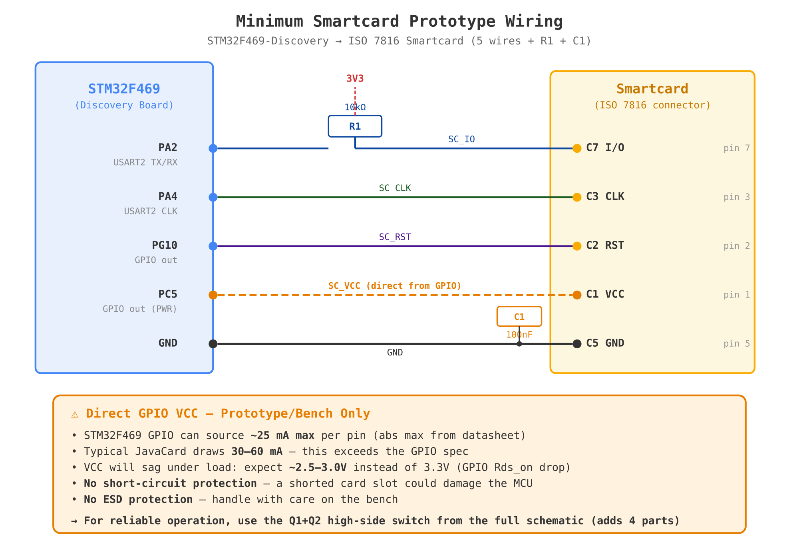

# Minimal Smartcard Interface (ST8034 Fallback)


## Overview

This circuit provides a **fallback alternative** to the ST8034 smartcard
interface IC using only JLCPCB basic parts. It is intended for situations where
ST8034 chips become unavailable or cost-prohibitive. It pipes the CLK and data
(I/O) lines straight through from the STM32F469 MCU to the smartcard, adds
ESD/TVS protection on every signal line, and powers the card from the 3.3V rail
through a MCU-controlled switch.

**The ST8034 remains the preferred smartcard interface** — it provides a more
robust feature set including integrated TVS/ESD protection, firmware-selectable
voltage classes (1.8V/3.0V/5.0V), built-in short-circuit protection, and
automatic activation sequencing. Both the ST8034HNQR (24-pin, Shield v1) and
ST8034ATDT (16-pin, Shield-BE) support voltage selection via firmware — the
HNQR uses VCC_SEL1/VCC_SEL2 pins, while the ATDT uses its CMDVCC pin. This
means if a future card requires a different voltage class (e.g. 1.8V or 5V),
the ST8034-based shields can adapt via firmware alone.

This discrete design is a useful backup that works well with current JavaCards
(tested with J3H145 and J3R180), but is limited to a fixed 3.3V (Class C)
output and cannot negotiate voltage classes.

**No firmware changes are required** — the MCU pin assignments and `uscard`
driver configuration remain identical to the original ST8034-based shield.

## MCU Pin Mapping

These pins are defined in `src/keystore/javacard/util.py` and are unchanged:

| MCU Pin | Net Name | Function | ISO 7816 Pin |
|---------|----------|----------|-------------|
| PA2     | SC_IO    | Bidirectional data (USART2 in ISO 7816 mode) | C7 (I/O) |
| PA4     | SC_CLK   | Clock output (USART2 smartcard clock) | C3 (CLK) |
| PG10    | SC_RST   | Reset output (active-low) | C2 (RST) |
| PC5     | SC_PWR   | Power enable (active-high) | — |
| PC2     | SC_DET   | Card detect (active-low) | — |

## Circuit Description

### Signal Lines (Direct Pass-Through)

- **SC_IO (PA2 → Card C7):** The ISO 7816 I/O line is bidirectional and
  open-drain. A 10kΩ pull-up resistor (R1) to V3V3 is required per the ISO 7816
  spec. This is the same pull-up the ST8034 provides internally.

- **SC_CLK (PA4 → Card C3):** The smartcard clock is generated by the STM32's
  USART2 peripheral in ISO 7816 mode. It passes straight through — no
  buffering needed at these frequencies (typically 1–5 MHz).

- **SC_RST (PG10 → Card C2):** The reset line passes straight through from the
  MCU. The STM32 drives this directly.

### ESD Protection

All signal lines are protected by TVS diodes to prevent ESD damage:

- **D1 (PESD5V0S2BT):** Dual-channel TVS in SOT-23. Channel 1 protects SC_IO,
  channel 2 protects SC_CLK.
- **D2 (PESD5V0S2BT):** Second dual TVS. Channel 1 protects SC_RST, channel 2
  protects SC_VCC.

The PESD5V0S2BT has 5V standoff voltage and very low capacitance (~35pF),
suitable for the smartcard signalling speeds without affecting timing.

### Power Switch (VCC Control)

The ST8034's main active function was controlling card VCC. We replace it with a
two-transistor high-side switch plus a discrete current limiter:

```
PC5 (HIGH to enable) → R2 (10kΩ) → Q2 gate (2N7002 N-FET)
                                       │
Q2 drain ──────────────────────────── Q1 base (SS8550 PNP) ←── Q3 collector
                                       │                         │
Q1 emitter ← V3V3                     Q1 collector               Q3 (SS8050 NPN)
                                       │                         │
                                    R5 (6.8Ω sense)           Q3 base ← top of R5
                                       │                      Q3 emitter → bottom of R5
                                    SC_VCC → Card C1
                                       │
R3 (10kΩ) pulls Q1 base to V3V3      C1 (100nF) decouples SC_VCC
(keeps Q1 OFF when Q2 is OFF)
```

**Operation:**
1. **MCU sets PC5 HIGH** → Q2 (N-FET) turns ON → Q2 drain pulls Q1 base to GND
2. Q1 (PNP) turns ON → V3V3 flows through R5 to SC_VCC → Card is powered
3. **MCU sets PC5 LOW** → Q2 OFF → R3 pulls Q1 base back to V3V3 → Q1 OFF → Card unpowered

This gives the firmware full control over card activation/deactivation sequencing,
exactly as it had with the ST8034.

### Current Limiting (R5 + Q3)

A classic two-transistor current limiter protects the card VCC line:

- **R5 (6.8Ω)** is a sense resistor in series between Q1's collector and SC_VCC.
  As current flows through R5, it develops a voltage drop across it.
- **Q3 (SS8050 NPN)** has its base connected to the Q1-collector side (top) of
  R5 and its emitter connected to the SC_VCC side (bottom) of R5. Its collector
  connects to Q1's base.

**How it works:**
- When card current is below the limit, the voltage across R5 is less than
  Q3's Vbe (~0.6V), so Q3 is OFF and has no effect.
- When card current exceeds the limit, the voltage across R5 exceeds 0.6V,
  turning Q3 ON. Q3's collector pulls Q1's base toward SC_VCC, reducing Q1's
  base drive and throttling the current.
- The circuit self-regulates at the threshold: **I_limit = Vbe(Q3) / R5 ≈
  0.6V / 6.8Ω ≈ 88mA**

This is well within the ISO 7816 Class C maximum of 80mA (with a small margin
for Vbe variation). The typical operating current for JavaCards is 30–60mA,
well below this limit. In a short-circuit condition, the current is hard-clamped
to ~88mA, protecting both the card and the 3.3V supply rail.

**Tuning:** To adjust the current limit, change R5:
| R5 Value | Current Limit | Notes |
|----------|--------------|-------|
| 4.7Ω     | ~128mA       | More headroom, less protection |
| 6.8Ω     | ~88mA        | **Default** — matches ISO 7816 Class C |
| 10Ω      | ~60mA        | Tighter limit, may be too low for some cards |
| 12Ω      | ~50mA        | Very conservative |

All of these are JLCPCB basic 0805 resistors.

### Card Detection

The card connector's mechanical detect switch (SW pin) connects to PC2 through a
10kΩ pull-up (R4) to V3V3. When a card is inserted, the switch closes to GND,
pulling PC2 low. This matches the existing firmware's active-low detection.

## Bill of Materials (JLCPCB Basic Parts)

All components are from the JLCPCB Basic Parts library — no extended part fees.

| Ref | Component | Value | Package | LCSC | Description |
|-----|-----------|-------|---------|------|-------------|
| R1  | Resistor  | 10kΩ  | 0805    | C17414 | I/O pull-up (ISO 7816 open-drain) |
| R2  | Resistor  | 10kΩ  | 0805    | C17414 | Q2 gate resistor |
| R3  | Resistor  | 10kΩ  | 0805    | C17414 | Q1 base pull-up (keeps VCC off at startup) |
| R4  | Resistor  | 10kΩ  | 0805    | C17414 | Card detect pull-up |
| R5  | Resistor  | 6.8Ω  | 0805    | C17798 | Current sense resistor (sets ~88mA limit) |
| C1  | Capacitor | 100nF | 0805    | C49678 | SC_VCC decoupling |
| Q1  | PNP BJT   | SS8550 | SOT-23 | C2149  | High-side VCC switch |
| Q2  | N-FET     | 2N7002 | SOT-23 | C8545  | Inverts SC_PWR to drive Q1 |
| Q3  | NPN BJT   | SS8050 | SOT-23 | C2150  | Current sense — shunts Q1 base on overcurrent |
| D1  | Dual TVS  | PESD5V0S2BT | SOT-23 | C85364 | ESD on SC_IO + SC_CLK |
| D2  | Dual TVS  | PESD5V0S2BT | SOT-23 | C85364 | ESD on SC_RST + SC_VCC |

**Total: 11 components (5× 0805, 3× SOT-23 transistors, 2× SOT-23 TVS, 1× 0805 cap)**

Estimated BOM cost: **< $0.35** (excluding card connector)

## ST8034 Advantages vs This Discrete Design

The ST8034 is a purpose-built smartcard interface IC that provides a more robust
and feature-rich solution. This discrete design covers the basics but cannot
match all of the ST8034's capabilities:

| Feature | ST8034 | This Discrete Design |
|---------|--------|---------------------|
| ESD/TVS protection | ✅ Integrated, rated per ISO 7816 | ✅ D1, D2 (PESD5V0S2BT) — equivalent |
| VCC switching | ✅ Internal high-side switch | ✅ Q1 + Q2 — equivalent |
| Level shifting | ✅ Internal, multi-class | ⚠️ Not needed at 3.3V, but no flexibility |
| **Voltage class selection** | ✅ **1.8V / 3.0V / 5.0V via firmware** | ❌ **Fixed 3.3V only** |
| Short-circuit protection | ✅ Integrated, auto-shutdown | ✅ R5 + Q3 current limiter (~88mA) |
| Activation sequencing | ✅ Automatic per ISO 7816-3 | ⚠️ Handled by firmware (`uscard` driver) |
| Over-temperature protection | ✅ Built-in | ❌ Not available |

**Key difference: voltage flexibility.** Both ST8034 variants used in Specter
shields support firmware-controlled voltage selection:
- **ST8034HNQR** (Shield v1): VCC_SEL1/VCC_SEL2 pins routed to MCU GPIOs, tied
  high (default 5V). Firmware can select 1.8V/3.0V/5.0V.
- **ST8034ATDT** (Shield-BE): CMDVCC pin selects 3V (high) or 5V (low); also
  supports automatic voltage class detection.

This matters if future JavaCards require different voltage classes. The current
cards (J3H145, J3R180) work fine at 3.3V, but the ST8034 provides a path to
support other cards without hardware changes.

## Reference: STM32H7 Direct-Connect Design

This discrete approach is validated by production hardware. A commercial device
based on the STM32H7 uses an essentially identical topology for its smartcard
interface — no smartcard IC, just direct MCU-to-card connections:

- **P-FET high-side switch** (RZM002P02T2L) for VCC control — same role as our
  Q1 (SS8550 PNP) + Q2 (2N7002). They use a single P-channel MOSFET with a
  220kΩ gate pull-up, controlled directly from MCU (MCU_SC_PRES pin).
- **Direct signal routing** — SC_USART_CLK → Card CLK, SC_USART_TX → Card I/O,
  SC_RST → Card RESET. No buffering, no level shifting, just straight through.
- **ESD protection** via ESDS312DBVR (quad-channel TVS in SOT-23-6) — same
  concept as our 2× PESD5V0S2BT dual TVS, just packaged in one part.
- **VCC decoupling** — 4.7µF + 100nF, similar to our single 100nF.
- **Card presence switch** — mechanical detect, active-low, same as ours.

The main difference is they power the card from a dedicated **3.0V rail** (V3P0)
rather than 3.3V. This puts VCC right in the middle of the ISO 7816 Class C
range (2.7V–3.3V), giving more margin at both ends. See the VCC voltage
discussion below.

### VCC Voltage: 3.3V vs Dedicated 3.0V

The existing ST8034 on the Specter Shield powers the card at 3.3V (Class C),
and this works fine with all tested JavaCards. Our discrete design does the same.

If tighter Class C compliance is desired, a small LDO could drop 3.3V to 3.0V
for SC_VCC. This would:
- Move VCC to the center of the Class C range (2.7V–3.3V)
- Eliminate any concern about the R5 sense resistor's ~0.2–0.6V drop pushing
  SC_VCC below 2.7V under load
- Add one more component (LDO + its decoupling caps)

The STM32H7 reference device includes exactly this option: an **ADP125ARHZ-R7**
LDO (500mA, <130mV dropout) with an ADJ-pin resistor divider
(R14=182kΩ / R1=35.7kΩ, 1%) to set VOUT = 0.5V × (1 + 182/35.7) ≈ **3.05V**.
Input and output caps are 4.7µF + 100nF each. This is a clean drop-in: feed
V3V3 into VIN, route VOUT to SC_VCC instead of V3V3.

For the Specter use case, **3.3V is fine** — the ST8034 was already using it,
the JavaCards we target support it, and the typical ~0.3V drop through R5 at
normal operating current (30–60mA) keeps SC_VCC at ~3.0V anyway. A dedicated
3.0V regulator is an option for future designs that want maximum margin.

## Prototyping: Minimum Wiring



For a quick bench prototype you only need **2 passive components and 5 wires**:

| Wire | MCU Pin | Card Pin | Notes |
|------|---------|----------|-------|
| SC_IO | PA2 | C7 (I/O) | + R1 10kΩ pull-up to 3V3 (required by ISO 7816) |
| SC_CLK | PA4 | C3 (CLK) | Direct wire |
| SC_RST | PG10 | C2 (RST) | Direct wire |
| SC_VCC | PC5 | C1 (VCC) | Direct from GPIO — see warning below |
| GND | GND | C5 (GND) | + C1 100nF decoupling cap across VCC–GND at card |

### Can I drive VCC directly from the GPIO pin?

**Yes, for a bench prototype** — the firmware already drives PC5 high/low to
control card power, so wiring it straight to the card's VCC pin will technically
work. However, you're operating outside the GPIO's rated limits:

- **STM32F469 GPIO max source current: ~25 mA per pin** (absolute maximum from
  datasheet). Typical JavaCards draw **30–60 mA**, which exceeds this.
- **VCC will sag** under load due to the GPIO's internal Rds_on. Expect
  **~2.5–3.0V** at the card instead of 3.3V. Most JavaCards tolerate this
  (ISO 7816 Class C range is 2.7–3.3V), but you're at the edge.
- **No short-circuit protection** — a shorted card slot could damage the MCU pin
  or the 3.3V rail.
- **No ESD protection** — handle with care on the bench.

This is fine for a "does the card talk?" proof of concept. Many people prototype
smartcard interfaces this way successfully. If communication is unreliable, the
VCC sag is the first thing to check.

### Upgrading from prototype to reliable

To move from direct-GPIO to a proper VCC supply, add just **4 parts** from the
full schematic:

| Ref | Part | LCSC | Role |
|-----|------|------|------|
| Q1 | SS8550 PNP | C2149 | High-side VCC switch (sources from 3V3 rail, not GPIO) |
| Q2 | 2N7002 N-FET | C8545 | Inverts PC5 to drive Q1 |
| R2 | 10kΩ | C17414 | Q2 gate resistor |
| R3 | 10kΩ | C17414 | Q1 base pull-up (keeps VCC off at startup) |

This gives you full 3.3V at up to 200mA (PNP-limited), clean on/off control,
and no GPIO stress. Add R5 + Q3 for current limiting if you want short-circuit
protection (the full 11-part BOM above).

**No firmware changes** are needed at any stage — the `uscard` driver treats PC5
as a simple on/off pin regardless of what's behind it.

## Limitations

1. **Fixed 3.3V output — no voltage class selection** — Unlike the ST8034, this
   circuit cannot switch between 1.8V, 3.0V, and 5.0V. Cards requiring Class A
   (5V) or Class B (1.8V) will not work. Current target JavaCards (J3H145,
   J3R180) support Class C (3V) and work fine, but if future cards need a
   different voltage, the ST8034-based shields can handle it via firmware.

2. **Current limit has ~±15% tolerance** — The 88mA limit depends on Q3's Vbe
   (which varies with temperature, typically 0.55V–0.65V). In practice this
   means the actual limit is roughly 80–95mA, which safely brackets the ISO
   7816 Class C 80mA spec.

3. **~0.6V voltage drop under max load** — At 88mA through R5, the drop is
   ~0.6V, giving SC_VCC ≈ 2.7V. This is at the lower edge of the Class C range
   (2.7V–3.3V). At typical operating current (30–60mA), the drop is only
   0.2–0.4V, giving SC_VCC ≈ 2.9–3.1V which is comfortable.

4. **3.3V is at the upper edge of Class C spec** (2.7V–3.3V) — This is within
   spec and works in practice with all tested JavaCards.

## Firmware Reference

The `uscard.Reader` in `src/keystore/javacard/util.py` initializes the smartcard
interface with these exact pins:

```python
reader = sc.Reader(
    name="Specter card reader",
    ifaceId=2,         # USART2 in ISO 7816 mode
    ioPin=Pin.cpu.A2,  # SC_IO  → Card C7
    clkPin=Pin.cpu.A4, # SC_CLK → Card C3
    rstPin=Pin.cpu.G10,# SC_RST → Card C2
    presPin=Pin.cpu.C2,# SC_DET → Card detect switch
    pwrPin=Pin.cpu.C5, # SC_PWR → Q2 gate → Q1 → Card VCC
)
```

This configuration is **completely unchanged** — the minimal circuit is a
transparent, drop-in replacement for the ST8034.

## Applicability

This discrete design serves as a **fallback smartcard interface** when ST8034
chips are unavailable or cost-prohibitive:

- **Shield Lite** ([`shield-lite/`](../../shield-lite/)) — a practical backup
  when the ST8034ATDT is out of stock. All components meet the Shield Lite
  design criteria (JLCPCB basic, single-side assembly, hand-solderable).
- **Shield v1** ([`shield/kicad/`](../kicad/)) — can replace U6 (ST8034
  C2674058) and its surrounding passives if the IC is unavailable.
- **New shield designs** — consider this circuit as a backup option. For
  designs that may need voltage class flexibility in the future, the ST8034
  (or equivalent) remains the better choice.

**When to prefer the ST8034:** If the ST8034 is available and affordable, it
is the better option — it provides voltage class selection, integrated
protection, and automatic activation sequencing that this discrete circuit
cannot match.
